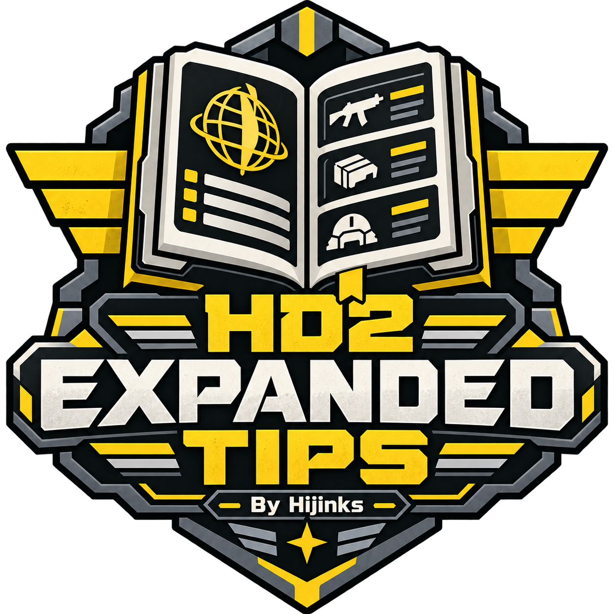

# HD2 Expanded Tips - 250 TIPS

**By Hijinks | v2.0.0**

**250 loading-screen tips** mixing useful gameplay advice, Helldivers lore, Super Earth propaganda, and dry community humor. Keep **all 82 original vanilla tips** and add **168 custom tips**, with a fresh selection from the library each time you launch.

**112 Useful • 58 Lore • 80 Funny**

[Download v2.0.0](https://github.com/Hijinkssss/hd2-expanded-tips/releases/tag/v2.0.0) | [Nexus Mods](https://www.nexusmods.com/helldivers2/mods/16970)

## Choose your categories in Arsenal

All categories, Useful + Lore, Useful + Funny, Lore + Funny, Useful only, Lore only, Funny only, or Vanilla only. Every combination keeps the original 82 vanilla tips eligible. **All categories** gives you the complete 250-tip library.

Choose your categories in Arsenal, confirm, deploy, then launch. There is no in-game setup menu.

Examples:

- “SEAF Artillery fires shells in the order they were loaded. Plan your ammunition sequence carefully.”
- “The Illuminate were declared eradicated after the First Galactic War. Their return is an administrative inconvenience.”
- “The resupply pod delivers four boxes. Please stop trying to become the fifth.”

## Installation

1. Close Helldivers 2 and install [Bingus Shared Loader v19 / API 1](https://github.com/CowboyBingus/BingusSharedLoader/releases/tag/loader-v19) through Arsenal.
2. Disable the old Expanded Tips package and any other Expanded Tips version.
3. Import `HD2-Expanded-Tips-2.0.0-Arsenal.zip` into Arsenal and enable it.
4. Open its options, enable **Tip categories**, and choose your combination.
5. Confirm and deploy, then launch normally.

**Shared Loader is the only runtime dependency.** HD2ModCore and Mod Options Menu are not required. Old in-game category preferences are ignored.

## How the 250-tip library rotates

The game has 82 active tip slots. Each successful startup selects 82 unique eligible tips from a saved shuffled deck. That selection stays fixed for the session. With all 250 enabled, three launches make 246 different tips available; the fourth starts with the remaining four before moving into the next shuffled cycle.

The game still chooses which available tip appears on each loading screen, so you can see repeats within a session. The deck tracks selected pools, not individual tips you have seen. Changing categories resets the deck. To change an option, close the game, redeploy in Arsenal, and launch again.

## Compatibility and removal

US English text; supported Steam build 25480438. Unsupported executable/game DLL fingerprints are rejected by the runtime checks. Future game updates may require an update to this mod. Other replacements of the US UI dictionary or loading-tip table may conflict.

To remove: close the game, disable/remove Expanded Tips in Arsenal, and redeploy. Shared Loader can remain installed for your other mods. Saved rotation state stays under `%LOCALAPPDATA%/CowboyBingus/Helldivers2/ExpandedTipsRC2/rotation.state`; the legacy folder name is intentional.

## Version 2.0.0

- 250 tips: 82 unchanged vanilla tips and 168 custom tips.
- Eight Arsenal category combinations.
- Persistent shuffled rotation at startup.
- Shared Loader as the sole runtime dependency.
- 418 offline checks passed across all eight profiles and startup lifecycle cases. Live testing of this final Shared Loader-only package is pending.

The native 82-slot selector remains unchanged. A temporary startup wait retires after success, failure, or a 30-second timeout; no mission-time reshuffle is added.

The [older v1.0.0 release](https://github.com/Hijinkssss/hd2-expanded-tips/releases/tag/v1.0.0) remains available as a legacy 82-tip localization replacement. Its source and validation records describe that older version.

## Credits and permissions

By Hijinks. Bingus Shared Loader and embedded Bingus Shared Runtime helpers by CowboyBingus. Archive tooling by FileDiver and the HD2 community. Logo created with AI assistance. Game assets belong to their respective owners. Unofficial community mod.

See [RIGHTS.md](RIGHTS.md). No open-source license has been selected for the author's work; embedded third-party helpers retain their own license.

[More mods and guides by Hijinks](https://hijinkssss.github.io/)
